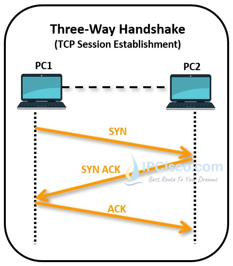
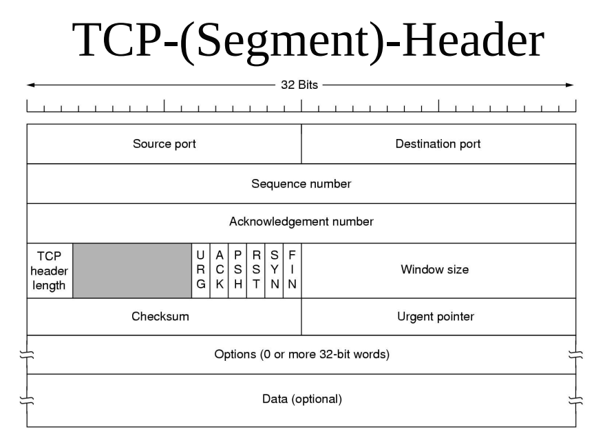
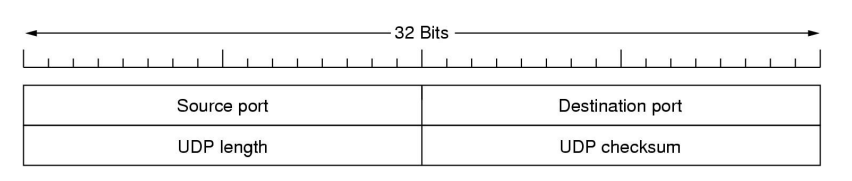
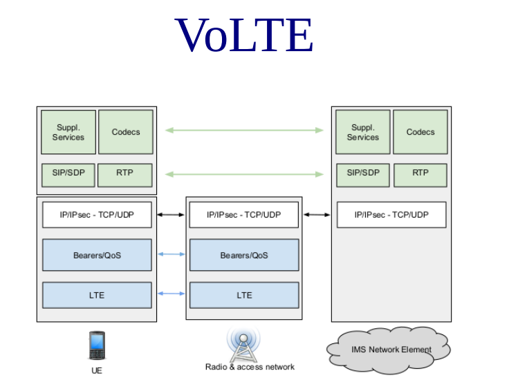
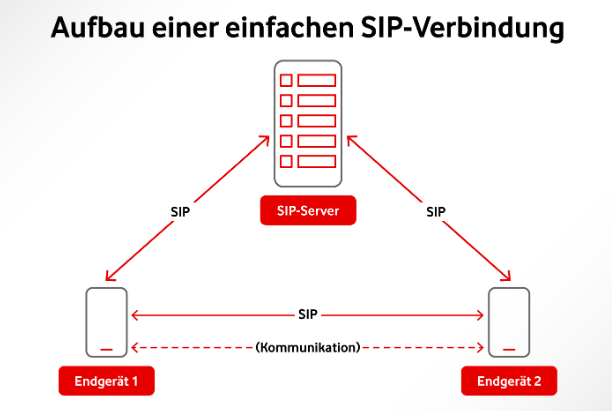
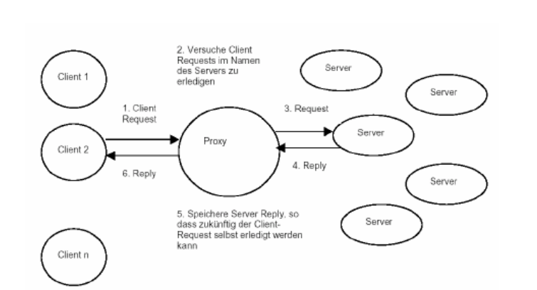

# Fragenkatalog: Netze und Verteilte Systeme 2
Autor: Dominic König


## Inhaltsverzeichnis
1. [Transport Layer](#transport-layer)
2. [Upper Layers and Web Services](#upper-layers-and-web-services)

---

## Transport Layer

#### 1. Erklären Sie die Aufgaben der Transportschicht
- **Aufgaben der Transportschicht:** Sie ermöglicht die Kommunikation zwischen Anwendungsprozessen auf unterschiedlichen Hosts. Sie segmentiert und reassembliert Daten aus Anwendungsschicht-Nachrichten, verwaltet Verbindungen (bei verbindungsorientierten Protokollen) und kontrolliert die Datenflusssteuerung sowie Fehlerkorrektur.

---

#### 2. Erklären Sie die Dienstqualitäten der Transportschicht
- **Dienstqualitäten der Transportschicht:** Beinhaltet Zuverlässigkeit, Durchsatzsteuerung, Latenzmanagement und Fehlererkennung. Protokolle wie TCP bieten zuverlässige Datenübertragung, während andere wie UDP geringeren Overhead bei möglicherweise weniger Zuverlässigkeit bieten.

---

#### 3. Beschreiben Sie die fünf generischen Transportschicht-Operationen
- **Fünf generische Transportschicht-Operationen:**
  1. **Segmentierung:** Aufteilung großer Datenmengen in kleinere Pakete.
  2. **Übertragung:** Senden der segmentierten Daten an den Zielhost.
  3. **Fehlerkontrolle:** Erkennung und Korrektur von Fehlern in übertragenen Daten.
  4. **Flusskontrolle:** Vermeidung von Datenüberflutung beim Empfänger.
  5. **Multiplexing/Demultiplexing:** Verwaltung mehrerer Kommunikationsströme über einen einzigen physischen Kanal.

---

#### 4. Skizzieren Sie die Berkeley Sockets für einen verbindungsorientierten Dienst und beschreiben Sie, wozu die einzelnen Operationen gebraucht werden.
- **Berkeley Sockets für verbindungsorientierten Dienst:**
  - **socket()**: Erstellt einen neuen Kommunikationspunkt (Socket).
  - **bind()**: Weist dem Socket eine Adresse zu.
  - **listen()**: Markiert den Socket als passiv, der Verbindungen akzeptiert.
  - **accept()**: Akzeptiert eine eingehende Verbindung.
  - **connect()**: Initiiert eine Verbindung zu einem Server.
  - **send()/recv()**: Sendet/Empfängt Daten über eine Verbindung.
  - **close()**: Beendet die Verbindung und gibt Ressourcen frei.

---

#### 5. Wie kann ein Client den Port eines Server-Dienstes herausfinden?
- **Portermittlung:** Ein Client kann den Port eines Serverdienstes über Dienste wie DNS oder durch Standardportnummern (wie HTTP auf Port 80) herausfinden. In manchen Fällen wird der Port auch in der Dokumentation des Dienstes angegeben.

---

#### 6. Wozu dient ein Schiebefenster und wie kann man die erforderliche Schiebefenstergröße berechnen?
**Schiebefenster:** Dient zur Flusskontrolle und Effizienzsteigerung bei der Datenübertragung, indem es die Anzahl der unbestätigten Pakete begrenzt. Die Größe des Fensters kann basierend auf der Bandbreite und der Latenz (Bandbreiten-Latenz-Produkt) berechnet werden.

---

#### 7. Welche Ansätze für Flow Control auf der Transportschicht kennen Sie?
- **Ansätze für Flow Control:**
  - **Schiebefenster-Verfahren:** Dynamische Anpassung der Datenmenge, die gesendet werden kann, bevor eine Bestätigung erforderlich ist.
  - **Rate-based Ansatz:** Begrenzung der Übertragungsrate basierend auf der Netzwerkkapazität.
  - **Credit-based Ansatz:** Der Sender erhält "Credits" für die übertragbare Datenmenge.

---

#### 8. Welche Ansätze für Congestion Control auf der Transportschicht kennen Sie?
- **Ansätze für Congestion Control:**
  - **Slow-Start-Algorithmus:** Allmähliches Erhöhen der Übertragungsrate bis zum Erreichen einer Schwelle.
  - **Congestion Avoidance:** Reduzierung der Übertragungsrate bei Anzeichen von Netzwerküberlastung.
  - **Fast Retransmit und Fast Recovery:** Schnelle Reaktion auf Paketverluste ohne das Sendefenster sofort zu reduzieren.

---

#### 9. Charakterisieren Sie TCP.
- **TCP (Transmission Control Protocol):** 
- Ein verbindungsorientiertes, zuverlässiges Protokoll. Es bietet sequenzielle Datenübertragung, Flusskontrolle, Staukontrolle und Fehlerkorrektur. TCP stellt sicher, dass alle gesendeten Daten ohne Fehler und in der richtigen Reihenfolge beim Empfänger ankommen.

---
#### 10. Skizzieren Sie den TCP 3-way handshake.


---
#### 11. Erklären Sie die gebräuchlichsten TCP-Optionen? Was ist PAWS?
- **Gebräuchlichste TCP-Optionen:**
  - **Maximum Segment Size (MSS):** Bestimmt die maximale Größe der übertragenen Segmente.
  - **Window Scale:** Erlaubt größere Fenstergrößen für Flusskontrolle.
  - **Selective Acknowledgement (SACK):** Ermöglicht Bestätigung einzelner Segmente.
  - **Timestamps:** Wann wurden die Pakete versendet - um das nachvollziehen zu können.
- **PAWS (Protection Against Wrapped Sequence numbers):** Verhindert das falsche Akzeptieren von veralteten Segmenten, die wegen der Wiederverwendung von Sequenznummern auftreten könnten.

---

#### 12. Beschreiben Sie die Algorithmen, die TCP zur Überlastkontrolle verwendet.
- **TCP-Überlastkontrollalgorithmen:**
  - **Slow Start:** Erhöht die Übertragungsrate exponentiell, bis ein Paketverlust festgestellt wird.
  - **Congestion Avoidance:** Erhöht die Rate linear, um Überlastung zu vermeiden.
  - **Fast Retransmit:** Sendet verlorene Segmente neu, ohne auf den Timeout zu warten.
  - **Fast Recovery:** Reduziert die Fenstergröße nicht vollständig nach einem Paketverlust.

---

#### 13. Wozu dienen und wie funktionieren Duplicate ACKs?
- **Duplicate ACKs:** Sie werden gesendet, wenn ein out-of-order-Segment empfangen wird. Sie signalisieren dem Sender, dass ein Segment fehlt, was auf potenziellen Paketverlust hinweist. Dies kann den Sender veranlassen, das fehlende Segment erneut zu senden, ohne auf einen Timeout zu warten.

---

#### 14. Wozu dienen und wie funktionieren Cumulative ACKs?
- **Cumulative ACKs:** Bestätigen alle bis zu einem bestimmten Punkt korrekt empfangenen Daten. Sie sind weniger granular als Selective ACKs, reduzieren aber den Overhead, da nicht jedes einzelne Segment bestätigt werden muss.

---

#### 15. Wozu dienen und wie funktionieren Selective ACKs?
- **Selective ACKs (SACK):** Erlauben die Bestätigung einzelner, nicht aufeinanderfolgender Segmente. Dies verbessert die Effizienz in Situationen, in denen Pakete verloren gehen oder die Reihenfolge verändert wird, da der Sender nur die tatsächlich fehlenden Segmente neu übertragen muss.

---

#### 16. Wozu dienen NAKs? Wann ist ihre Verwendung sinnvoll?
- **NAKs (Negative Acknowledgements):** Signalisieren den Empfang fehlerhafter oder fehlender Daten. Sie sind in Netzwerken sinnvoll, in denen Fehlerraten hoch sind, da sie eine schnellere Korrektur ermöglichen als das Warten auf einen Timeout.

---

#### 17. Skizzieren Sie den TCP Header und erklären Sie die Felder.


- **Source Port (Quellport)**: Die Portnummer des Senders.
- **Destination Port (Zielport)**: Die Portnummer des Empfängers.
- **Sequence Number (Sequenznummer)**: Gibt die Reihenfolge der gesendeten Bytes an, um eine korrekte Zusammensetzung beim Empfänger zu gewährleisten.
- **Acknowledgment Number (Bestätigungsnummer)**: Die nächste erwartete Sequenznummer vom Empfänger.
- **TCP Header Length (TCP-Header-Länge)**: Gibt die Länge des TCP-Headers in 32-Bit-Worten an.
- **Flags**: Eine Gruppe von Kontrollbits zur Steuerung der Verbindung (z. B. SYN, ACK, FIN).
- **Window Size (Fenstergröße)**: Gibt an, wie viele Bytes der Empfänger ohne Bestätigung empfangen kann.
- **Checksum (Prüfsumme)**: Dient zur Fehlererkennung für den Header und die Nutzdaten.
- **Urgent Pointer (Dringlichkeitszeiger)**: Markiert die Position dringender Daten im Datenstrom.
- **Options (Optionen)**: Zusätzliche optionale Felder, die für erweiterte Funktionen genutzt werden können.
- **Data (Daten)**: Der eigentliche Nutzdateninhalt des Segments, optional je nach Anwendung.
---
#### 18. Was sind CUBIC und BBR und welches Problem gibt es beim Mix beider?
- **CUBIC und BBR:**
  - **CUBIC:** Ein TCP Congestion Control Algorithmus, der die Fenstergröße kubisch anstatt linear erhöht.
  - **BBR (Bottleneck Bandwidth and RTT):** Nutzt Bandbreiten- und Latenzmessungen zur Steuerung der Übertragungsrate.
- **Problem beim Mix:** Die unterschiedlichen Ansätze können zu Fairness-Problemen führen, da BBR schneller auf Bandbreitenänderungen reagiert und somit in gemischten Netzwerken einen Vorteil haben kann.

---

#### 19. Was ist TCP Head-of-line-blocking und was bedeutet es für darüberliegende Protokolle?
- **TCP Head-of-line-blocking:** Tritt auf, wenn in einer TCP-Verbindung aufeinanderfolgende Pakete in der Reihenfolge abhängig sind. Wenn ein Paket verloren geht, können nachfolgende Pakete nicht verarbeitet werden, bis das fehlende Paket neu übertragen und empfangen wird. Dies kann die Leistung darüberliegender Protokolle beeinträchtigen, da die Datenübertragung durch den Verlust eines einzelnen Pakets verzögert wird.
---

#### 20. Skizzieren Sie den UDP Header und beschreiben Sie die Felder. Welche Protokolle bauen auf UDP auf und warum?
- **UDP Header:**
  - **Source Port (2 Byte):** Portnummer des Absenders.
  - **Destination Port (2 Byte):** Portnummer des Empfängers.
  - **Length (2 Byte):** Gesamtlänge des UDP-Pakets in Bytes.
  - **Checksum (2 Byte):** Zur Fehlerüberprüfung des Headers und der Daten.
- **Protokolle auf UDP-Basis:** DNS (schnelle Anfragen), SNMP (einfache Management-Operationen), DHCP (Effizienz und einfache Implementierung), RTP (Echtzeit-Datenübertragung), VoIP, Online-Spiele (geringe Latenz).



---

#### 21. Welche Eigenschaften/Vorteile hat TCP, die für UDP wünschenswert wären?
- **Eigenschaften von TCP, wünschenswert für UDP:**
  - **Zuverlässige Datenübertragung:** Sicherstellen, dass alle gesendeten Daten beim Empfänger ankommen.
  - **Flusskontrolle:** Verhindert Überlastung des Empfängers.
  - **Staukontrolle:** Vermeidet Netzwerküberlastung.
  - **Datenreihenfolge-Garantie:** Sicherstellt, dass Daten in der Reihenfolge empfangen werden, in der sie gesendet wurden.

---

#### 22. Welche Eigenschaften/Vorteile hat UDP, die für TCP wünschenswert wären?
- **Eigenschaften von UDP, wünschenswert für TCP:**
  - **Geringerer Overhead:** Schnellere Datenübertragung durch weniger Header-Informationen.
  - **Keine Verbindungsaufbauzeit:** Ermöglicht sofortigen Datenaustausch ohne vorherigen Handshake.
  - **Eignung für Broadcast- und Multicast-Übertragungen.**

---

#### 23. Erklären Sie, wie TCP auf Teilstrecken optimiert werden kann und was die Vor- und Nachteile sind.
- **Optimierung von TCP auf Teilstrecken:**
  - **TCP Splitting:** Teilt eine TCP-Verbindung in mehrere Segmente, um Latenzzeiten und Überlastung zu reduzieren.
  - **Vorteile:** Kann Latenz und Paketverluste reduzieren, besonders in Netzwerken mit hoher Latenz oder Überlastung.
  - **Nachteile:** Kann die End-to-End-Semantik von TCP verändern und Sicherheitsmechanismen beeinträchtigen.

---

#### 24. Erläutern Sie MultiPath TCP und was die Herausforderungen dabei sind.
- **MultiPath TCP (MPTCP):**
  - **Beschreibung:** Ermöglicht die Nutzung mehrerer Pfade für eine TCP-Verbindung.
  - **Vorteile:** Verbesserte Bandbreitennutzung, Redundanz und Lastverteilung.
  - **Herausforderungen:** Komplexität in der Pfadverwaltung und -auswahl, Fairness gegenüber herkömmlichem TCP-Verkehr, Sicherheitsbedenken.

---

#### 25. Charakterisieren Sie DCCP. Welche Anwendungen könnten es verwenden?
- **DCCP (Datagram Congestion Control Protocol):**
  - **Beschreibung:** Protokoll für nicht zuverlässige Datenströme, bietet Congestion Control.
  - **Anwendungen:** Streaming-Medien, Online-Spiele, VoIP, wo gelegentlicher Datenverlust akzeptabel ist, aber Staukontrolle wichtig ist.

---

#### 26. Charakterisieren Sie SCTP. Welche Anwendungen könnten es verwenden?
- **SCTP (Stream Control Transmission Protocol):**
  - **Beschreibung:** Bietet Multistreaming und Multihoming-Fähigkeiten für zuverlässige Datenübertragungen.
  - **Anwendungen:** Signalisierungsverkehr in Telefonnetzwerken, Hochverfügbarkeits-Systeme, datenintensive Anwendungen wie Dateiübertragung.

---

#### 27. Charakterisieren Sie QUIC. Welche Anwendungen könnten es verwenden?
- **QUIC (Quick UDP Internet Connections):**
  - **Beschreibung:** Protokoll über UDP, das geringe Latenz, Multiplexing und verbesserte Sicherheit bietet.
- **Anwendungen:**  
  - **Webbrowser (z. B. Chrome)**: Für schnellere Ladezeiten und geringere Latenz.
  - **Videostreaming-Dienste (z. B. YouTube, Netflix)**: Für eine flüssigere Wiedergabe bei schlechter Internetverbindung.
  - **Online-Spiele**: Für geringere Latenz und stabilere Verbindungen.
  - **VoIP und Videokonferenzen**: Für verbesserte Audio- und Videoqualität in Echtzeit.

---

#### 28. Warum baut QUIC auf UDP auf und was sind die Vor-/Nachteile davon?
- **Warum QUIC auf UDP basiert:**
  - **Vorteile:** Geringere Latenz durch Wegfall des Handshakes, keine Head-of-line-Blocking-Probleme, bessere Performance in mobilen und wechselhaften Netzwerken.
  - **Nachteile:** Weniger verbreitet und akzeptiert in Netzwerkinfrastrukturen, möglicherweise Herausforderungen bei der Überwindung von Firewalls und NATs.

---

#### 29. Welche intrinsischen Probleme von TCP versucht QUIC wie zu lösen?
- **Intrinsische TCP-Probleme, die QUIC löst:**
  - **Head-of-line-Blocking:** QUIC verhindert Blockierung durch unabhängige Streams.
  - **Verbindungsmobilität:** QUIC kann Verbindungen bei IP-Änderungen aufrechterhalten.
  - **Schnellere Verbindungszeiten:** Durch das Kombinieren des Verbindungsaufbaus mit dem Schlüsselaustausch.
  - **Verbesserte Sicherheit:** Standardmäßige Ende-zu-Ende-Verschlüsselung.

---

#### 30. Was ist bei Transportschichtprotokollmessungen zu beachten?
- **Transportschichtprotokollmessungen:**
  - **Bandbreitennutzung:** Überwachung der genutzten Bandbreite zur Leistungsoptimierung.
  - **Latenz und Jitter:** Messung der Verzögerung und Varianz im Netzwerk.
  - **Paketverlust:** Überwachung von Datenverlusten für Qualitätssicherung.
  - **Fehleranalyse:** Identifikation und Diagnose von Netzwerkproblemen.

---

#### 31. Welche Designaspekte von Transportschichtprotokollen sind zu beachten?
- **Designaspekte von Transportschichtprotokollen:**
  - **Zuverlässigkeit vs. Geschwindigkeit:** Abwägung zwischen Übertragungssicherheit und Effizienz.
  - **Fluss- und Staukontrolle:** Notwendige Mechanismen zur Vermeidung von Netzwerküberlastung.
  - **Multiplexing:** Effiziente Nutzung von Netzwerkressourcen durch parallele Datenströme.
  - **Sicherheitsaspekte:** Einbeziehung von Verschlüsselung und Authentifizierung.
  - **Skalierbarkeit und Anpassungsfähigkeit:** Anpassung an unterschiedliche Netzwerkbedingungen und -kapazitäten.

---
## Upper Layers and Web Services
#### 32. Was sind die wichtigsten Aufgaben der Sitzungsschicht?
- **Aufgaben der Sitzungsschicht:**
  - **Aufbau, Verwaltung und Beendigung von Sitzungen:** Ermöglicht Kommunikationssitzungen zwischen Anwendungen auf unterschiedlichen Endgeräten.
  - **Synchronisation:** Hilft bei der Wiederaufnahme der Kommunikation nach einem Abbruch.
  - **Dialogsteuerung:** Ermöglicht die Organisation und Steuerung des Datenaustauschs, inklusive Vollduplex- und Halbduplex-Kommunikation.

---

#### 33. Was sind die wichtigsten Aufgaben der Darstellungsschicht?
- **Aufgaben der Darstellungsschicht:**
  - **Datenformatierung:** Wandelt Daten in ein generisches Format um, das für die Netzwerkschicht geeignet ist.
  - **Datenkompression:** Reduziert die Größe der Daten, um Bandbreite zu sparen.
  - **Verschlüsselung:** Schützt Daten durch Verschlüsselung vor unbefugtem Zugriff.

---

#### 34. Was sind die wichtigsten Aufgaben der Anwendungsschicht?
- **Aufgaben der Anwendungsschicht:**
  - **Dienstbereitstellung:** Bietet Netzwerkdienste direkt für die Endanwender.
  - **Netzwerktransparenz:** Ermöglicht Anwendern den Zugriff auf Netzwerkressourcen unabhängig von ihrer physikalischen oder logischen Natur.
  - **Datenübertragungsverwaltung:** Koordiniert und verwaltet die Datenübertragung zwischen Anwendungen und Diensten.

---

#### 35. Erklären Sie fünf DNS-resource records.
- **DNS-Resource Records:**
  - **A (Address Record):** Verknüpft einen Domainnamen mit der IPv4-Adresse eines Hosts.
  - **AAAA (IPv6 Address Record):** Verknüpft einen Domainnamen mit der IPv6-Adresse eines Hosts.
  - **CNAME (Canonical Name Record):** Verknüpft einen Aliasnamen mit dem eigentlichen Domainnamen.
  - **MX (Mail Exchange Record):** Gibt an, welcher Mailserver für eine Domain zuständig ist.
  - **NS (Name Server Record):** Zeigt an, welche Nameserver für eine bestimmte Domain zuständig sind.

---

#### 36. Warum gibt es MX und NS in DNS resource records?
- **MX (Mail Exchange) Records:** Wichtig für das E-Mail-Routing. Sie bestimmen, welcher Server E-Mails für eine Domain empfängt.
- **NS (Name Server) Records:** Er definiert, welche Nameserver für diese Zone offiziell zuständig sind, oder. er verkettet Zonen zu einem Zonen-Baum.
---

#### 37. Wie funktioniert die DNS-Namensauflösung? Was tun name server und resolver?
- **DNS-Namensauflösung:**
  - **Resolver:** Startet die Anfrage zur Übersetzung eines Domainnamens in eine IP-Adresse.
  - **Name Server:** Antwortet auf Anfragen zur Namensauflösung. Root-Nameserver leiten Anfragen weiter an TLD-Nameserver, die wiederum an autoritative Nameserver für die spezifische Domain weiterleiten.

---

#### 38. Nennen Sie 10 TLD Namen und ihren Einsatzbereich.
- **10 TLD Namen und Einsatzbereiche:**
  - **.com:** Kommerzielle Unternehmen.
  - **.org:** Non-Profit-Organisationen.
  - **.net:** Netzwerkinfrastrukturen.
  - **.edu:** Bildungseinrichtungen.
  - **.gov:** Regierungsbehörden.
  - **.de:** Deutschland, länderspezifisch.
  - **.uk:** Vereinigtes Königreich, länderspezifisch.
  - **.info:** Informationsseiten.
  - **.biz:** Geschäftliche Zwecke.
  - **.io:** Beliebt in der Technologie- und Startup-Szene.

---

#### 39. Wozu braucht man und wie funktioniert dynamisches DNS?
- **Dynamisches DNS (DDNS):**

  - **Zweck:** Ermöglicht es, Domainnamen auf sich ändernde IP-Adressen zu mappen, was nützlich ist bei Internetanschlüssen mit dynamischer IP-Zu weisung.

  - **Funktionsweise:** Ein DDNS-Service aktualisiert automatisch den DNS-Eintrag, sobald sich die IP-Adresse des Hosts ändert, wodurch der Host unter demselben Domainnamen erreichbar bleibt.

---
#### 40. Welche Alternativen gibt es zu DNS?
- **DNS-Alternativen:**
  - **Multicast DNS (mDNS):** Erlaubt die Auflösung von Hostnamen in lokalen Netzwerken ohne zentralen DNS-Server.
  - **Hostdatei:** Manuelle Zuordnung von IP-Adressen zu Hostnamen in einer lokalen Datei.
  - **LISP:** Locator/ID Separation Protocol
  - **ENS:** Ethereum Name Service

---

#### 41. Was ist bei internationalen Domänennamen zu beachten?
- **Internationale Domänennamen:**
  - **Punycode:** Verwendung von Punycode zur Darstellung von Unicode-Zeichen in Domainnamen, die nur ASCII unterstützen.
  - **Sprachspezifische Zeichen:** Berücksichtigung unterschiedlicher Zeichensätze und Sprachregeln.
  - **Verständlichkeit und Eindeutigkeit:** Sicherstellen, dass der Domainname in verschiedenen Sprachen und Kulturen eindeutig und verständlich bleibt.

---

#### 42. Welche SMTP Headerfelder sind nach RFC 5322 verpflichtend? Welche dürfen nur einmal vorkommen?
- **Verpflichtende SMTP Headerfelder nach RFC 5322:**
  - **Date:** Datum und Uhrzeit der Nachrichtenerstellung.
  - **From:** Absender der E-Mail.
- **Einmalige Headerfelder:**
  - **Message-ID:** Eindeutige Kennung der Nachricht.
  - **In-Reply-To:** Referenz auf die Nachricht-ID einer vorherigen Nachricht.

---

#### 43. Nennen und beschreiben Sie fünf MIME-Header Felder.
- **Fünf MIME-Header Felder:**
  - **Content-Type:** Definiert den Medientyp und Subtyp der Nachrichteninhalte.
  - **Content-Transfer-Encoding:** Spezifiziert die Kodierung (z.B. Base64) der Nachrichteninhalte.
  - **Content-Disposition:** Gibt an, wie der Inhalt präsentiert werden soll (z.B. als Anhang).
  - **Content-ID:** Eindeutige Identifikation eines Nachrichtenteils.
  - **MIME-Version:** Zeigt die verwendete MIME-Version an.

---

#### 44. Nennen Sie zehn MIME-Typ/Subtyp Kombinationen.
- **Zehn MIME-Typ/Subtyp Kombinationen:**
  - **text/plain:** Unformatierter Text.
  - **text/html:** HTML-Dokument.
  - **image/jpeg:** JPEG-Bild.
  - **image/png:** PNG-Bild.
  - **application/pdf:** PDF-Dokument.
  - **application/zip:** ZIP-Archiv.
  - **audio/mpeg:** MP3-Audio.
  - **video/mp4:** MP4-Video.
  - **application/json:** JSON-Daten.
  - **application/javascript:** JavaScript-Code.

---

#### 45. Beschreiben Sie die Merkmale, die „sichere“ E-mail erfüllen soll?
- **Merkmale „sicherer“ E-Mail:**
  - **Verschlüsselung:** Ende-zu-Ende- und Transportverschlüsselung zum Schutz der Daten.
  - **Authentifizierung:** Sicherstellen, dass Absender und Empfänger die sind, für die sie sich ausgeben.
  - **Integrität:** Gewährleistung, dass der Inhalt während der Übertragung nicht verändert wurde.
  - **Nicht-Abstreitbarkeit:** Möglichkeit, den Absender einer Nachricht eindeutig zu identifizieren und zu beweisen.

---

#### 46. Welche Verfahren verwendet PGP wofür?
- **Verfahren von PGP (Pretty Good Privacy):**
  - **Asymmetrische Verschlüsselung:** Zum sicheren Austausch von Schlüsseln.
  - **Symmetrische Verschlüsselung:** Für die Verschlüsselung der eigentlichen Nachricht.
  - **Digitale Signaturen:** Zur Authentifizierung und Sicherstellung der Integrität der Nachricht.

---

#### 47. Skizzieren Sie den VoLTE Stack und beschreiben Sie kurz die verwendeten Protokolle.
- **VoLTE Stack:**
  - **SIP (Session Initiation Protocol):** Für das Aufsetzen, Verwalten und Beenden von Sprachanrufen.
  - **RTP (Real-time Transport Protocol):** Für

 die Übertragung von Audio- und Videodaten.
  - **Diameter-Protokoll:** Für Authentifizierung, Autorisierung und Abrechnung.
  - **GTP (GPRS Tunneling Protocol):** Für die Tunnelung von Daten durch das Mobilfunknetz.



---

#### 48. Welche Nachrichten verwendet SIP wofür?
- **SIP-Nachrichten:**
  - **INVITE:** Beginnt einen Anruf oder eine Sitzung.
  - **BYE:** Beendet eine aktive Sitzung.
  - **ACK:** Bestätigt den Erhalt von Antwortnachrichten.
  - **CANCEL:** Bricht eine laufende Anfrage ab.
  - **OPTIONS:** Erfragt Informationen über die Kommunikationsmöglichkeiten.

---

#### 49. Welche SIP-Komponenten gibt es und was sind ihre Aufgaben?
- **SIP-Komponenten:**
  - **User Agent (UA):** Endpunkt in SIP, initiierend (UA Client) oder antwortend (UA Server).
  - **SIP-Server:**
    - **Registrar:** Registriert Benutzer im Netzwerk.
    - **Proxy:** Leitet SIP-Anfragen weiter.
    - **Redirect Server:** Sendet dem Client Informationen zur direkten Kontaktaufnahme.
---
#### 50. Was wird mit SDP übertragen?
- **SDP (Session Description Protocol):** Überträgt Informationen für die Einrichtung und Verwaltung von Multimedia-Sitzungen. Dazu gehören:
  - Medientyp (Audio, Video, etc.)
  - Transportprotokolle (RTP/RTCP)
  - Medienformate und -attribute
  - Informationen zu Zeit und Dauer der Sitzung
  - Unicast- oder Multicast-Adressen der Sitzungsteilnehmer

---

#### 51. Skizzieren Sie die Funktionsweise von SIP anhand der versendeten Nachrichten.
- **Funktionsweise von SIP:**
  - **INVITE:** Initiierung eines Anrufs.
  - **Ringing:** Benachrichtigung, dass der Anruf beim Empfänger klingelt.
  - **OK:** Bestätigung des Anrufaufbaus.
  - **ACK:** Quittierung der OK-Nachricht.
  - **BYE:** Beenden des Anrufs.
  - **OK:** Bestätigung des Anrufendes.




---

#### 52. Beschreiben Sie fünf URI Schemata.
- **Fünf URI Schemata:**
  - **http:** Für HyperText Transfer Protocol, typischerweise für Webseiten.
  - **https:** Sichere Variante von HTTP, verwendet SSL/TLS.
  - **ftp:** File Transfer Protocol, für Dateiübertragungen.
  - **mailto:** Für E-Mail-Adressen.
  - **file:** Für den Zugriff auf lokale Dateien.

---

#### 53. Nennen Sie fünf HTTP Status Codes und ihre Bedeutung.
- **Fünf HTTP Status Codes:**
  - **200 OK:** Anfrage erfolgreich verarbeitet.
  - **404 Not Found:** Die angefragte Ressource wurde nicht gefunden.
  - **500 Internal Server Error:** Ein allgemeiner Fehler ist auf dem Server aufgetreten.
  - **301 Moved Permanently:** Die Ressource ist dauerhaft verschoben worden.
  - **403 Forbidden:** Der Zugriff auf die angeforderte Ressource ist verboten.

---

#### 54. Entwerfen sie einen fünfzeiligen gültigen HTTP 1.1 Request.
```
GET / HTTP/1.1
Host: www.example.com
Connection: close
User-Agent: SimpleClient/1.0
Accept: */*
```

---

#### 55. Wie sieht ein HTTP URI generisch aus und was bedeuten die einzelnen Bestandteile.
- **Generischer Aufbau eines HTTP URI:**
  - `http://www.example.com:80/path/to/file?query=string#fragment`
  - **http://**: Protokoll
  - **www.example.com**: Hostname oder IP-Adresse
  - **:80**: Portnummer (optional, standardmäßig 80 für HTTP)
  - **/path/to/file**: Pfad zur Ressource auf dem Server
  - **?query=string**: Abfrage-String (optional)
  - **#fragment**: Fragment-Identifier (optional)

---

#### 56. Entwerfen Sie einen minimalen HTTP 1.0 Request/Response. Warum funktioniert der bei HTTP 1.1 nicht?
- **Minimaler HTTP 1.0 Request:**
  ```
  GET /index.html HTTP/1.0
  ```
- **Minimaler HTTP 1.0 Response:**
  ```
  HTTP/1.0 200 OK
  Content-Type: text/html

  [HTML-Inhalte]
  ```
- **Grund der Inkompatibilität mit HTTP 1.1:** HTTP 1.1 erfordert den `Host`-Header, um den richtigen Virtual Host zu identifizieren, was in HTTP 1.0 nicht notwendig war.

---

#### 57. Was bedeuten und welche sind „safe methods“ bei HTTP?
- **Safe Methods bei HTTP:**
  - Bedeuten, dass die Methode keine Änderungen am Server bewirkt (idempotent).
  - Beispiele sind `GET`, `HEAD`, und `OPTIONS`.

---

#### 58. Welche Informationen kann ein Web-browser dem Server mitteilen? Warum ist das wichtig?
- **Informationen von Web-Browsern an Server:**
  - Browser-Typ und -Version (User-Agent).
  - Bevorzugte Sprachen (Accept-Language).
  - Akzeptierte Inhaltsformate (Accept).
  - Referrer-URL.
  - Cookies

 und Sitzungsinformationen.
- **Wichtigkeit:** Ermöglicht personalisierte Inhalte, Sprachspezifische Webseiten, Tracking für Analytics und Optimierung der Benutzererfahrung.

---

#### 59. Beschreiben Sie fünf Sicherheitsprobleme von HTTP 1.0.
- **Sicherheitsprobleme von HTTP 1.0:**
  - Keine Verschlüsselung: Daten können abgefangen werden.
  - Anfällig für Man-in-the-Middle-Angriffe.
  - Fehlende Authentifizierung und Integritätsprüfung.
  - Cookies und Authentifizierungsinformationen werden unverschlüsselt übertragen.
  - Anfälligkeit für Cross-Site-Scripting und Injection-Angriffe.

---

#### 60. Welche Änderungen hat HTTP 1.1 gebracht?
- **Änderungen in HTTP 1.1:**
  - Persistente Verbindungen (Connection Keep-Alive).
  - Chunked Transfer Encoding.
  - Einführung des Host-Headers.
  - Unterstützung für Pipelining von Anfragen.
  - Erweiterte Cache-Kontrollmechanismen.
  - Verbesserte Unterstützung für virtuelle Hosts.

---
#### 61. Was ist neu bei HTTP/2?
- **Neuerungen bei HTTP/2:**
  - **Multiplexing:** Mehrere Anfragen und Antworten können gleichzeitig über eine einzige TCP-Verbindung abgewickelt werden.
  - **Server Push:** Server können Ressourcen an den Client senden, bevor dieser danach fragt.
  - **Header-Kompression:** Verringert den Overhead durch effizientere Kodierung.
  - **Priorisierung von Anfragen:** Ermöglicht es, wichtigen Ressourcen Vorrang zu geben.
  - **Binärprotokoll:** Statt im textbasierten Format, werden Nachrichten in einem binären Format übertragen, was die Verarbeitung effizienter macht.

---

#### 62. Was ändert sich bei HTTP/3?
- **Änderungen bei HTTP/3:**
  - **Verwendung von QUIC statt TCP:** Verbessert die Verbindungsaufbauzeiten und die Zuverlässigkeit der Übertragung, besonders in mobilen Netzwerken.
  - **Verbesserte Handhabung von Paketverlusten:** Reduziert die Auswirkungen auf die Performance.
  - **Ende-zu-Ende-Verschlüsselung:** Standardmäßig durch die Nutzung von QUIC.
  - **Fortsetzung der HTTP/2-Verbesserungen:** Wie Multiplexing, Server Push und Header-Kompression.

---

#### 63. Entwerfen Sie ein einfaches Webformular in HTML?
```html
<form action="/submit-form" method="post">
  <label for="name">Name:</label>
  <input type="text" id="name" name="name"><br><br>
  <label for="email">Email:</label>
  <input type="email" id="email" name="email"><br><br>
  <input type="submit" value="Submit">
</form>
```

---

#### 64. Schreiben Sie eine einfache HTML5-Seite.
```html
<!DOCTYPE html>
<html>
<head>
    <title>Meine HTML5-Seite</title>
</head>
<body>
    <h1>Willkommen auf meiner Seite</h1>
    <p>Dies ist ein Absatz auf einer einfachen HTML5-Seite.</p>
</body>
</html>
```

---

#### 65. Was sind entscheidende Faktoren für die Geschwindigkeit eines Web-Dienstes?
- **Faktoren für die Geschwindigkeit eines Web-Dienstes:**
  - **Serverleistung:** CPU, RAM, und Speichergeschwindigkeit des Servers.
  - **Netzwerklatenz:** Verzögerungen bei der Datenübertragung im Netzwerk.
  - **Datenbankoptimierung:** Effizienz bei Abfragen und Datenmanagement.
  - **Caching:** Zwischenspeicherung von Daten zur schnelleren Auslieferung.
  - **Content Delivery Networks (CDN):** Lokale Verteilung von Inhalten zur Reduzierung der Latenz.
  - **Optimierung von Front-End-Ressourcen:** Minimierung und Kompression von CSS, JavaScript und Bildern.

---

#### 66. Was sind die Herausforderungen für UPnP über IPv4?
- **Herausforderungen für UPnP über IPv4:**
  - **NAT (Network Address Translation):** Kann die Gerätekommunikation und die Portweiterleitung beeinträchtigen.
  - **Sicherheit:** UPnP kann Sicherheitsrisiken darstellen, da es Geräten erlaubt, Netzwerkeinstellungen zu ändern.
  - **IP-Adressknappheit:** Begrenzte Anzahl verfügbarer IPv4-Adressen.

---

#### 67. Beschreiben Sie die grundlegenden Funktionen von UPnP und welche Protokolle/Standards dafür jeweils verwendet werden?
- **Grundlegende Funktionen von UPnP:**
  - **Automatische Geräteerkennung:** Ermöglicht Geräten, sich gegenseitig zu finden und zu identifizieren.
  - **Dynamische Host-Konfiguration:** Geräte können automatisch IP-Adressen und andere Netzwerkeinstellungen beziehen.
  - **Service Discovery:** Ermöglicht Geräten, Dienste von anderen Geräten im Netzwerk zu finden und zu nutzen.
- **Verwendete Protokolle/Standards:**
  - **SSDP (Simple Service Discovery Protocol):** Für die Entdeckung von UPnP-Geräten.
  - **SOAP (Simple Object Access Protocol**): Für die Kommunikation zwischen Geräten.
  - **GenA (General Event Notification Architecture):** Für Ereignisbenachrichtigungen.

---

#### 68. Welche Sicherheitsanforderungen werden an Kommunikation gestellt?
- **Sicherheitsanforderungen an Kommunikation:**
  - **Vertraulichkeit:** Schutz der Daten vor unbefugtem Zugriff.
  - **Integrität:** Sicherstellung, dass die Daten während der Übertragung nicht verändert werden.
  - **Authentizität:** Verifizierung der Identität der kommunizierenden Parteien.
  - **Nicht-Abstreitbarkeit:** Sicherstellung, dass die Aktionen der Beteiligten nachweisbar sind.
  - **Verfügbarkeit:** Gewährleistung, dass die Kommunikationsdienste verfügbar und zugänglich sind.

---

#### 69. Nennen Sie fünf Architekturmodelle und wozu sie dienen.
- **Fünf Architekturmodelle:**
  - **Client-Server-Modell:** Verteilte Anwendung, bei der Server Dienste anbieten und Clients diese nutzen.
  - **Peer-to-Peer (P2P):** Jeder Knoten kann sowohl als Client als auch als Server fungieren.
  - **Drei-Schichten-Architektur:** Aufteilung in Präsentationsschicht, Logikschicht und Datenspeicherschicht.
  - **Serviceorientierte Architektur (SOA):** Dienste werden über ein Netzwerk bereitgestellt und genutzt.
  - **Microservices-Architektur:** Anwendung besteht aus kleinen, unabhängigen Diensten, die spezifische Geschäftsfunktionen erfüllen.

---

#### 70. Skizzieren Sie Funktionsweise eines proxy?
- **Funktionsweise eines Proxy:**
  - **Anfragen:** Ein Proxy nimmt Anfragen von einem Client entgegen.
  - **Weiterleitung:** Der Proxy leitet die Anfragen an den Zielserver weiter.
  - **Antwort:** Der Proxy empfängt die Antwort vom Server.
  - **Rückgabe:** Der Proxy sendet die Antwort an den ursprünglichen Client zurück.
  - **Zwischenspeicherung (optional):** Der Proxy kann Antworten zwischenspeichern, um zukünftige Anfragen schneller zu beantworten.




---

#### 71. Wann und wofür kommt ein reverse-proxy zum Einsatz?
- **Einsatz von Reverse-Proxies:**
  - **Lastverteilung:** Verteilung des eingehenden Datenverkehrs auf mehrere Server zur Optimierung der Auslastung und Reduzierung von Überlastungen.
  - **Sicherheit:** Schutz der Identität des Backend-Servers und Bereitstellung einer zusätzlichen Sicherheitsschicht.
  - **Caching:** Zwischenspeicherung von Inhalten zur Verbesserung der Antwortzeiten.
  - **SSL-Terminierung:** Entschlüsselung von SSL/TLS-Anfragen und Weiterleitung als normale Anfragen.

---

#### 72. Erklären Sie drei Cloud-Arten und benennen Sie jeweilige Dienstanbieter.
- **Drei Cloud-Arten:**
  - **Infrastructure as a Service (IaaS):** Bereitstellung von Infrastruktur wie Server und Speicher (z.B. Amazon Web Services, Microsoft Azure).
  - **Platform as a Service (PaaS):** Bereitstellung von Plattformen für die Entwicklung und das Hosting von Anwendungen (z.B. Google App Engine, Heroku).
  - **Software as a Service (SaaS):** Bereitstellung von Softwareanwendungen über das Internet (z.B. Salesforce, Microsoft Office 365).

---

#### 73. Wann ist ein Dienst RESTful und was sind dabei die Einschränkungen?
- **RESTful Dienst:**
  - **Stateless:** Jede Anfrage muss alle notwendigen Informationen enthalten.
  - **Client-Server-Architektur:** Klare Trennung zwischen Client und Server.
  - **Cacheable:** Antworten müssen als cacheable oder nicht-cacheable markiert sein.
  - **Uniform Interface:** Einheitliche Schnittstelle für die Interaktion.
- **Einschränkungen:**
  - Fehlende Zustandsverwaltung kann bei komplexen Transaktionen problematisch sein.
  - Starke Abhängigkeit von der Qualität der Dokumentation und Einhaltung von Standards.

---

#### 74. Erklären Sie vier „Bausteine“ von Web-Services.
- **Bausteine von Web-Services:**
  - **SOAP (Simple Object Access Protocol):** Protokoll für den Austausch strukturierter Informationen.
  - **WSDL (Web Services Description Language):** Sprache zur Beschreibung der Web-Service-Schnittstelle.
  - **UDDI (Universal Description, Discovery, and Integration):** Standard für das Veröffentlichen und Auffinden von Web-Services.
  - **REST (Representational State Transfer):** Architekturstil, der auf stateless Kommunikation und Ressourcen basiert.

---

#### 75. Was ist GREASE und warum ist dieser Ansatz „hilfreich“?
- **GREASE (Generate Random Extensions And Sustain Extensibility):**
  - Ziel ist es, die Flexibilität und Erweiterbarkeit von Protokollen wie TLS zu gewährleisten, indem zufällige Werte in Protokollerweiterungen eingefügt werden.
  - Verhindert, dass Server sich auf nicht standardmäßige Verhaltensweisen verlassen, was langfristig die Interoperabilität verbessert.

---

#### 76. Charakterisieren Sie XML.
- **XML (Extensible Markup Language):**
  - Eine Markup-Sprache zur Beschreibung von strukturierten Daten.
  - Selbstbeschreibend, menschenlesbar und maschinenverarbeitbar.
  - Erweiterbar und anpassbar für verschiedene Anwendungsdomänen.
  - Wird häufig für Konfigurationsdateien, Datenübertragungen zwischen Systemen und in Web-Services verwendet.

---

#### 77. Skizzieren Sie ein einfaches XML Dokument.
- **Einfaches XML-Dokument:**
  ```xml
  <?xml version="1.0" encoding="UTF-8"?>
  <person>
      <name>Max Mustermann</name>
      <alter>30</alter>
      <wohnort>Berlin</wohnort>
  </person>
  ```

---

#### 78. Erklären Sie SOAP.
- **SOAP (Simple Object Access Protocol):**
  - Ein Protokoll für den Austausch von strukturierten Informationen in Web-Services.
  - Nutzt XML zur Kodierung von Nachrichten.
  - Unabhängig von der Transportebene, kann über HTTP, SMTP usw. verwendet werden.
  - Unterstützt sowohl

 Remote Procedure Calls (RPCs) als auch Nachrichtenaustausch.

---

#### 79. Was wird mit WSDL genau angegeben?
- **WSDL (Web Services Description Language):**
  - Eine XML-basierte Sprache zur Beschreibung der Funktionalitäten eines Web-Services.
  - Definiert die Schnittstelle, Methoden, Parameter und Datentypen.
  - Ermöglicht es Clients, automatisch zu verstehen, wie mit dem Web-Service interagiert werden kann.

---

#### 80. Wozu dient UDDI und wie kann es verwendet werden?
- **UDDI (Universal Description, Discovery, and Integration):**
  - Ein Standard für das Veröffentlichen und Auffinden von Web-Services.
  - Ermöglicht es Unternehmen, ihre Web-Services in einem globalen Verzeichnis zu registrieren.
  - Dient zur Suche nach Web-Services, die bestimmte Geschäftsprozesse oder Anforderungen erfüllen.

---

#### 81. Welche Schritte sind zum Aufruf eines Webdienstes durchzuführen?
- **Aufruf eines Webdienstes:**
  - Identifizierung des benötigten Dienstes und seines Endpunkts.
  - Erstellung der Anfrage, häufig als SOAP-Nachricht oder REST-Anfrage.
  - Übermittlung der Anfrage über das entsprechende Protokoll (z.B. HTTP).
  - Empfang und Verarbeitung der Antwort des Dienstes.

---

#### 82. Wie wird mit SNMP Netzwerk Management gemacht?
- **SNMP (Simple Network Management Protocol):**
  - Ein Protokoll zur Verwaltung und Überwachung von Netzwerkgeräten.
  - Ermöglicht das Abrufen von Informationen (GET), das Setzen von Konfigurationen (SET) und das Empfangen von Benachrichtigungen (TRAPS).
  - Wird in Netzwerkgeräten wie Routern, Switches und Servern eingesetzt.

---

#### 83. Charakterisieren Sie WebRTC.
- **WebRTC (Web Real-Time Communication):**
  - Eine Sammlung von Kommunikationsprotokollen und APIs für Echtzeit-Audio, -Video und Datenübertragung.
  - Ermöglicht direkte Peer-to-Peer-Kommunikation zwischen Webbrowsern und mobilen Anwendungen.
  - Keine Notwendigkeit für zusätzliche Plugins oder Softwareinstallationen.

---

#### 84. Was ist bei „Green Computing“ zu bedenken?
- **Green Computing:**
  - Reduzierung des Energieverbrauchs von Computersystemen und Datenzentren.
  - Nutzung erneuerbarer Energiequellen.
  - Effiziente Kühlung und Energiemanagement.
  - Verlängerung der Lebensdauer von Hardware.
  - Förderung von Recycling und nachhaltigen Praktiken im IT-Bereich.

---
